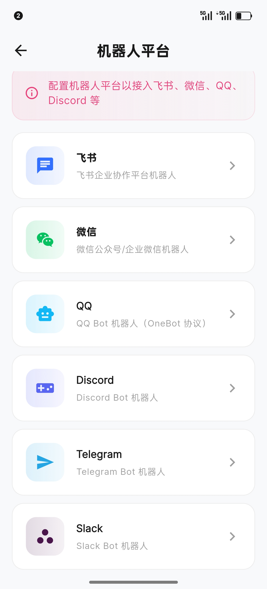
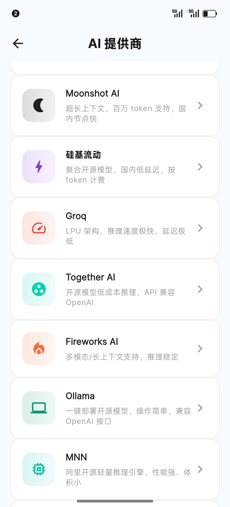
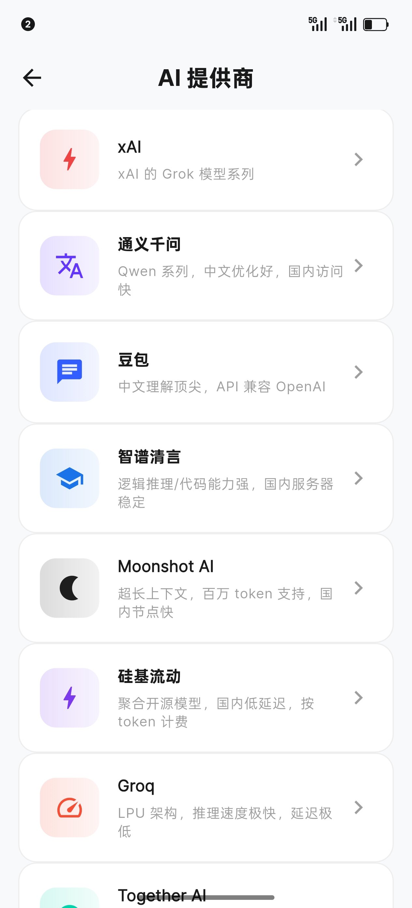
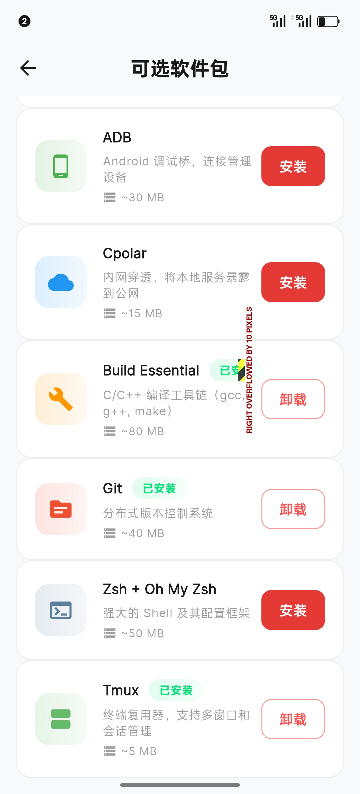
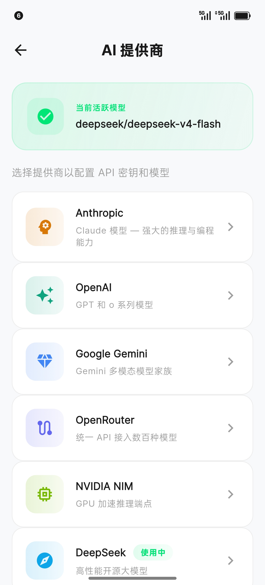
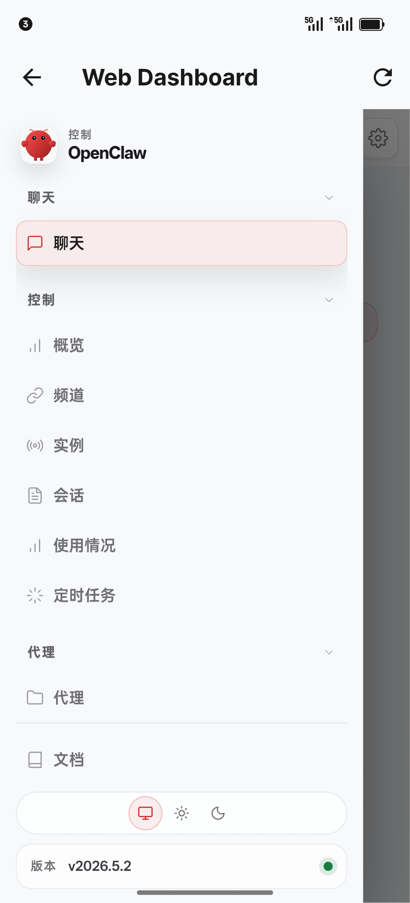
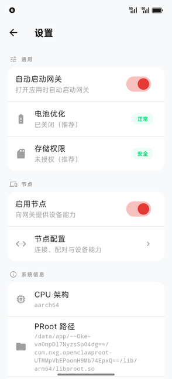
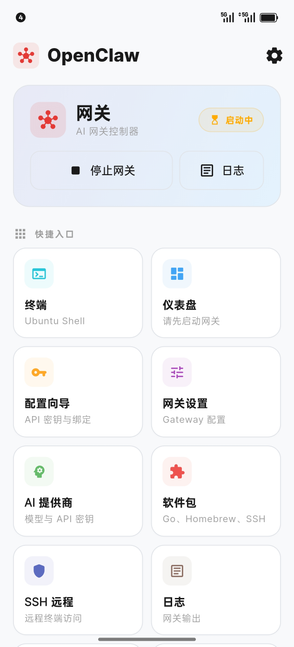

# OpenClaw

[](https://github.com/xiaoqishitou/openclaw-termux/releases/latest)
[](https://opensource.org/licenses/MIT)
[](https://nodejs.org/)
[](https://www.android.com/)
[](https://flutter.dev/)
[](https://www.npmjs.com/package/openclaw-termux)

<p align="center">
  
</p>

> 在 Android 上运行 **OpenClaw AI Gateway** — 独立 Flutter 应用，内置终端模拟器、Web 仪表盘、可选开发工具，以及一键式环境配置。同时提供 Termux CLI 包。
>
> Run **OpenClaw AI Gateway** on Android — standalone Flutter app with built-in terminal, web dashboard, optional dev tools, and one-tap setup. Also available as a Termux CLI package.

---

## 项目简介 | Project Overview

**OpenClaw** 将 [OpenClaw](https://github.com/anthropics/openclaw) AI 网关带到 Android 平台。它通过 proot 自动搭建完整的 Ubuntu 环境，安装 Node.js 和 OpenClaw，并提供原生 Flutter UI 来管理一切 — **无需 Root**。

OpenClaw brings the [OpenClaw](https://github.com/anthropics/openclaw) AI gateway to Android. It sets up a full Ubuntu environment via proot, installs Node.js and OpenClaw, and provides a native Flutter UI to manage everything — no root required.

| 特性 | Flutter App (独立应用) | Termux CLI |
|------|------------------------|------------|
| 安装方式 | 下载 APK 或自行构建 | `npm install -g openclaw-termux` |
| 环境配置 | 点击"开始配置" | `openclawx setup` |
| 启动网关 | 点击"启动网关" | `openclawx start` |
| 终端 | 内置终端模拟器 | Termux Shell |
| 仪表盘 | 内置 WebView | 浏览器访问 `localhost:18789` |

---

## 版本信息 | Version

**当前版本：v1.8.8**

本次更新（v1.8.8）重点包括：
- 新增 Bot 平台支持（Bot Platform）
- 新增多种节点能力：应用管理、剪贴板、联系人、设备信息、文件系统、手电筒
- 全局 UI 美化与中文本地化
- 配置自动修复（解决 `gateway.mode` 和模型配置格式问题）
- Node.js 升级至 22.14.0 LTS
- 蓝牙/USB 串口支持（Serial 节点能力）
- 网关日志时间戳
- 截图捕获功能
- 自定义 AI 模型支持
- SSH 远程访问
- AI 服务商配置（7 家提供商）

完整更新日志请查看 [CHANGELOG.md](openclaw-termux-1.8.7/CHANGELOG.md)。

---

## 界面预览 | Screenshots

<table align="center">
  <tr>
    <td align="center"><br/><b>机器人平台</b></td>
    <td align="center"><br/><b>AI 提供商</b></td>
    <td align="center"><br/><b>AI 提供商</b></td>
  </tr>
  <tr>
    <td align="center"><br/><b>可选软件包</b></td>
    <td align="center"></td>
    <td align="center"></td>
  </tr>
  <tr>
    <td align="center"></td>
    <td align="center"></td>
  </tr>
</table>

---

## 功能特性 | Features

### Flutter 应用
- **一键配置** — 自动下载 Ubuntu rootfs、Node.js 22 和 OpenClaw
- **内置终端** — 完整终端模拟器，支持扩展按键工具栏、复制/粘贴、可点击 URL
- **网关控制** — 启动/停止网关，状态指示器和健康检查
- **AI 服务商** — 配置 API 密钥并选择 7 家提供商的模型（Anthropic、OpenAI、Google Gemini、OpenRouter、NVIDIA NIM、DeepSeek、xAI）
- **SSH 远程访问** — 启动/停止 SSH 服务器，设置 root 密码，查看连接信息
- **配置菜单** — 在内置终端中运行 `openclaw configure` 管理网关设置
- **节点设备能力** — 7 种能力（15 个命令）通过 WebSocket 节点协议暴露给 AI
- **Token URL 显示** — 自动捕获并显示认证令牌 URL，支持一键复制
- **Web 仪表盘** — 嵌入式 WebView 加载带认证的仪表盘
- **实时日志** — 网关日志实时查看，支持搜索/筛选
- **可选包管理** — 可选安装 Go、Homebrew、OpenSSH
- **前台服务** — 后台保持网关运行，带运行时间追踪
- **中文本地化** — 全应用中文界面支持

### Termux CLI
- **单命令配置** — 自动安装 proot-distro、Ubuntu、Node.js 22 和 OpenClaw
- **Bionic 绕过** — 修复 Android Bionic libc 上的 `os.networkInterfaces()` 崩溃
- **智能加载** — 网关就绪前显示旋转等待动画
- **透传命令** — 通过 `openclawx` 运行任意 OpenClaw 命令

---

## 技术栈 | Tech Stack

| 层级 | 技术 |
|------|------|
| 前端 UI | Flutter 3.24 + Dart |
| 原生桥接 | Kotlin (Android Platform Channel) |
| 运行环境 | proot-distro + Ubuntu |
| 运行时 | Node.js 22 LTS |
| AI 网关 | OpenClaw |
| 节点协议 | WebSocket |

---

## 快速开始 | Quick Start

### Flutter App（推荐）

1. 从 [Releases](https://github.com/xiaoqishitou/openclaw-termux/releases) 下载最新 APK
2. 在 Android 设备上安装 APK
3. 打开应用，点击 **开始配置**
4. 配置完成后，在 **初始配置** 中设置 API 密钥
5. 点击仪表盘上的 **启动网关**

自行构建：

```bash
git clone https://github.com/xiaoqishitou/openclaw-termux.git
cd openclaw-termux/openclaw-termux-1.8.7/flutter_app
flutter build apk --release
```

### Termux CLI

**一键安装（推荐）：**

```bash
curl -fsSL https://raw.githubusercontent.com/xiaoqishitou/openclaw-termux/main/openclaw-termux-1.8.7/install.sh | bash
```

**或通过 npm：**

```bash
npm install -g openclaw-termux
openclawx setup
```

---

## 系统要求 | Requirements

| 要求 | 详情 |
|------|------|
| **Android** | 10 或更高版本 (API 29+) |
| **存储空间** | 约 500MB（Ubuntu + Node.js + OpenClaw） |
| **架构** | arm64-v8a, armeabi-v7a, x86_64 |
| **Termux** (CLI 模式) | 从 [F-Droid](https://f-droid.org/packages/com.termux/) 安装（非 Play Store 版本） |

---

## 节点能力 | Node Capabilities

Flutter 应用作为 **节点** 连接到网关，将 Android 硬件能力暴露给 AI：

| 能力 | 命令 | 权限 |
|------|------|------|
| **相机** | `camera.snap`, `camera.clip`, `camera.list` | 相机 |
| **闪光灯** | `flash.on`, `flash.off`, `flash.toggle`, `flash.status` | 相机（手电筒）|
| **定位** | `location.get` | 位置 |
| **屏幕录制** | `screen.record` | MediaProjection |
| **传感器** | `sensor.read`, `sensor.list` | 身体传感器 |
| **震动** | `haptic.vibrate` | 无需权限 |
| **串口** | `serial.list`, `serial.connect`, `serial.write`, `serial.read` | 蓝牙/USB |

---

## 项目结构 | Project Structure

```
openclaw-termux/
├── openclaw-termux-1.8.7/           # 主项目目录
│   ├── flutter_app/                 # Flutter 应用源码
│   │   ├── android/                 # Android 原生代码 (Kotlin)
│   │   ├── lib/                     # Dart 源码
│   │   │   ├── screens/             # 页面
│   │   │   ├── services/            # 服务层
│   │   │   ├── widgets/             # 自定义组件
│   │   │   └── ...
│   │   └── pubspec.yaml
│   ├── lib/                         # npm CLI 包源码
│   ├── bin/                         # CLI 入口
│   ├── assets/                      # 截图和资源
│   ├── install.sh                   # 一键安装脚本
│   └── package.json                 # npm 包配置
├── README.md                        # 本文件
└── LICENSE                          # MIT 许可证
```

---

## 重要提示 | Important Warnings

> **存储权限** — 本应用**不需要**完整存储权限即可运行。如果弹出提示，请**拒绝**存储权限，除非你确实需要 proot 访问 `/sdcard`。授予 `MANAGE_EXTERNAL_STORAGE` 将允许 proot 环境读取和修改设备上的**所有文件**。

> **电池优化** — 请在 Android 设置中为该应用禁用电池优化，以防止 Android 在后台终止网关进程。否则网关可能在几分钟后静默崩溃。

> **首次启动** — 初始配置将下载约 500MB 数据（Ubuntu rootfs + Node.js）。请确保网络连接稳定且存储空间充足。

---

## 故障排除 | Troubleshooting

### 网关无法启动

```bash
# 检查状态
openclawx status

# 重新运行配置
openclawx setup

# 确保初始配置已完成
openclawx onboarding
```

### "os.networkInterfaces" 错误

Bionic Bypass 未配置，重新运行配置：

```bash
openclawx setup
```

### 进程在后台被终止

在 Android 设置中禁用电池优化。

---

## 更新日志 | Changelog

详见 [CHANGELOG.md](openclaw-termux-1.8.7/CHANGELOG.md)。

**v1.8.8 摘要：**
- 新增 Bot 平台支持
- 新增应用管理、剪贴板、联系人、设备信息、文件系统、手电筒等节点能力
- 全局 UI 美化与中文本地化
- 配置自动修复（`gateway.mode=local` + 模型格式修复）
- Node.js 22.14.0 升级
- 蓝牙/USB 串口节点能力
- 截图捕获
- 自定义模型支持

---

## 贡献 | Contributing

欢迎提交 Pull Request！

1. Fork 本仓库
2. 创建功能分支 (`git checkout -b feature/amazing-feature`)
3. 提交更改 (`git commit -m 'Add amazing feature'`)
4. 推送到分支 (`git push origin feature/amazing-feature`)
5. 打开 Pull Request

---

## 许可证 | License

MIT License — 详见 [LICENSE](LICENSE) 文件。

---

<p align="center">
  基于 <a href="https://github.com/mithun50/openclaw-termux">mithun50/openclaw-termux</a> 修改维护
  <br/>
  Made with &#10084;&#65039; for the Android community
</p>
